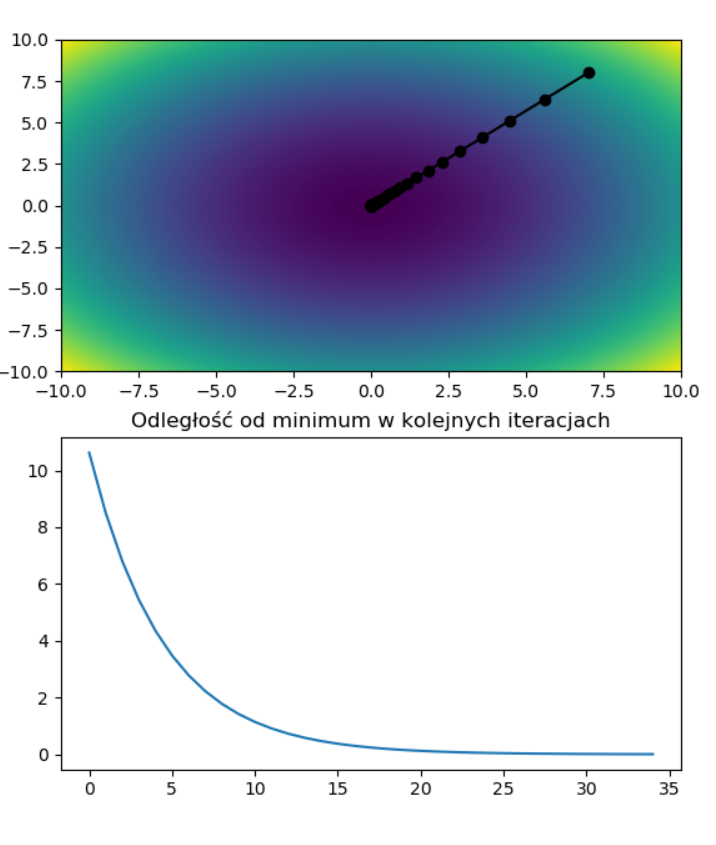
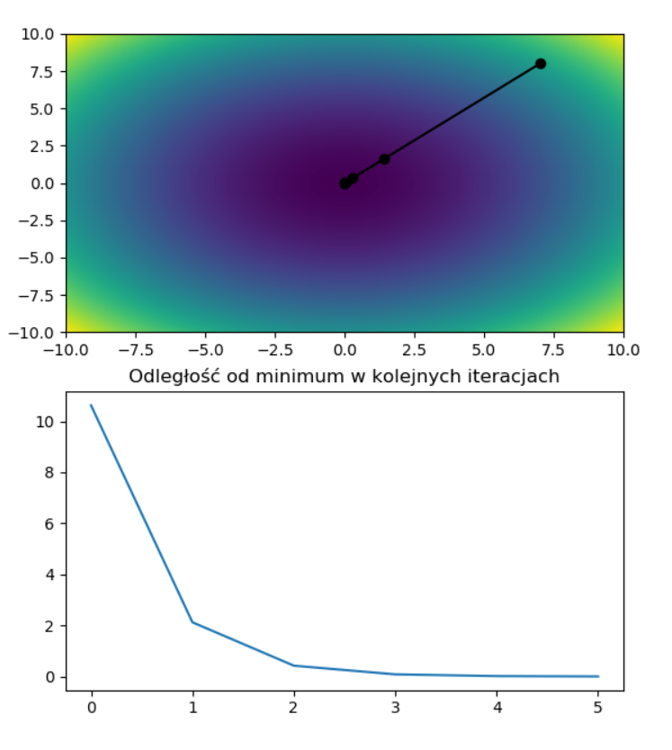
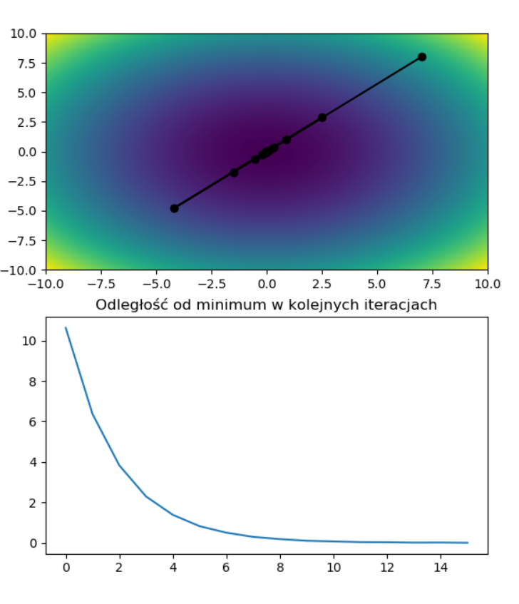
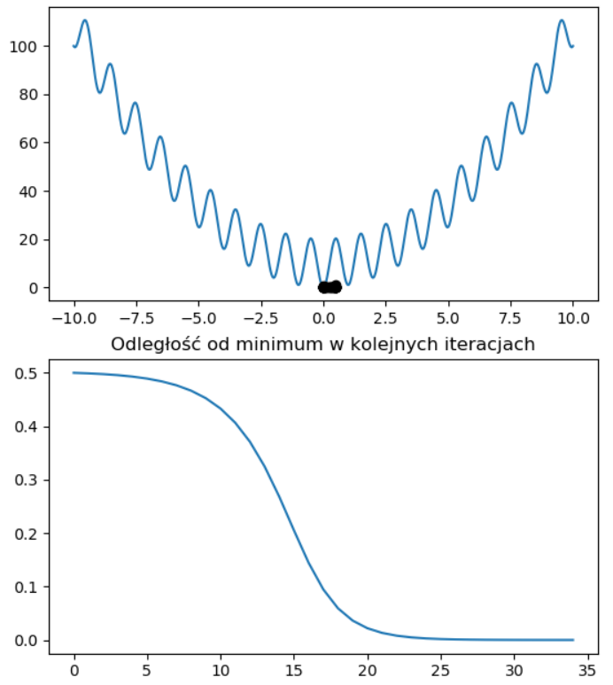
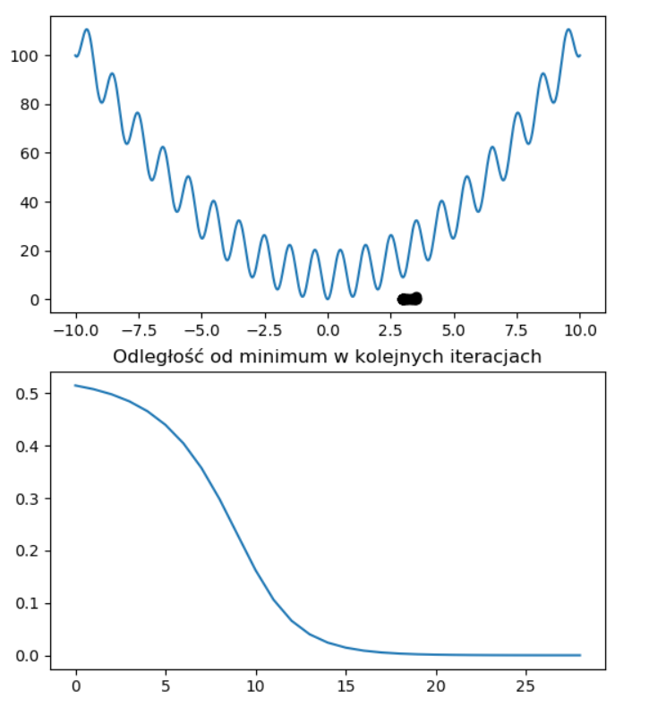
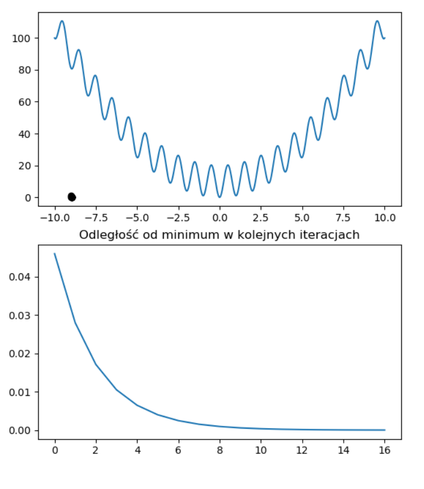

# Metoda najszybszego spadku
## Opis rozwiązania
Zadanie polegało na implementacji algorytmu gradientu prostego w celu
znalezienia minimum lokalnego funkcji. Napisany program prosi
użytkownika o podanie wzoru rozpatrywanej funkcji, wzoru jej gradientu,
skoku, dopuszczalnego błędu i punktu początkowego. Następnie wykonywany
jest algorytm, którego działanie ilustrowane zostaje na wykresach --
wizualizacji poszczególnych kroków oraz postępu zbliżania się do
minimum. W implementacji zastosowana została stała wartość kroku.

## Testowanie
Testy poprawności przeprowadzono dla podanych w poleceniu funkcji f i g,
zapisanych jako:

f(x, y) = x\*x + y\*y

g(x) = x\*x -10\*cos(2\*pi\*x) + 10

oraz ich gradientów.

Algorytm poprawnie wyznaczał wyniki zbliżone do punktu (0,0) dla funkcji
f i zbliżone do jednego z minimum lokalnych (w zależności od punktu
początkowego) dla funkcji g.

Zależności od wartości skoku
============================

Testy różnych wartości skoku zostały przeprowadzone dla funkcji f przy
stałym punkcie początkowym oraz dopuszczalnym błędzie. Poniżej
przedstawiam wynikowe wykresy dla poszczególnych parametrów:

skok = 0.1, punkt początkowy = (7, 8)

Liczba iteracji: 34

skok = 0.4, punkt początkowy = (7, 8)

Liczba iteracji: 5

skok = 0.8, punkt początkowy = (7, 8)

Liczba iteracji: 15

skok = 1.2, punkt początkowy = (7, 8)

Algorytm wpadł w oscylację i zakończył działanie z błędem Overflow Error
po 2104 krokach iteracji.

Na podstawie powyższych eksperymentów można stwierdzić, że zarówno zbyt
małe, jak i zbyt duże wartości skoku mogą poważnie wpływać na wydłużenie
czasu pracy algorytmu. Dodatkowo, wartości wyraźnie przekraczające
właściwe wprowadzają program w stan oscylacji, który prowadzi do braku
osiągnięcia poszukiwanego przez nas minimum lokalnego i błędu.

Zależności od wyboru punktu początkowego
========================================

Do tej serii eksperymentów wybrana została funkcja g ze względu na to,
że posiada ona wiele ekstremów lokalnych, co powinno pomóc dobrze ukazać
badane zależności. Do testów wybrana została stała, stosunkowo mała
wartość skoku oraz stały dopuszczalny błąd. Poniżej przedstawiam
wynikowe wykresy:

skok = 0.001, punkt początkowy: x = 0.5

Liczba iteracji: 34

skok = 0.001, punkt początkowy: x = 3.5

Liczba iteracji: 28

skok = 0.001, punkt początkowy: x = -9

Liczba iteracji: 16

Powyższe eksperymenty pokazują, że punkt początkowy wpływa przede
wszystkim na to, do którego minimum lokalnego trafi algorytm. Metoda
gradientu prostego nie posiada mechanizmu wychodzenia z ekstremów
lokalnych, zatem dobór punktu startu wydaje się być kluczowy w przypadku
funkcji posiadających więcej niż jedno minimum. Co więcej, dobrze
wybrany punkt może również skrócić czas działania programu, pod
warunkiem że będzie znajdował się on w pobliżu szukanego minimum.

## Wnioski
Metoda gradientu prostego jest stosunkowo szybkim sposobem znajdowania
minimum lokalnego zadanej funkcji. Eksperymenty przeprowadzone na
własnej implementacji algorytmu pokazały znaczenie wartości skoku oraz
punktu początkowego dla szybkości i poprawności metody. Największą
zauważalną w toku testowania wadą okazał się brak możliwości wyjścia
przez algorytm z ekstremum lokalnego, przez co nie będzie on idealnym
wyborem do poszukiwań minimum globalnych.
